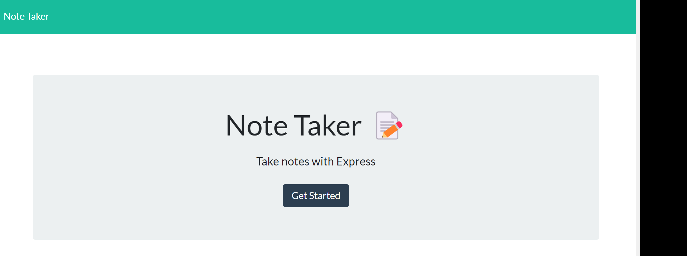
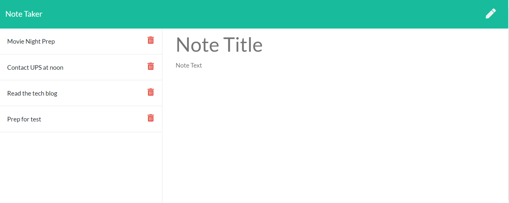
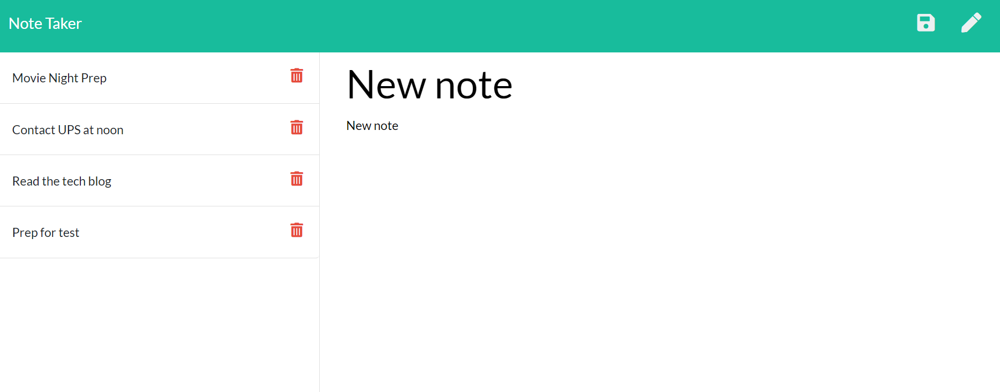
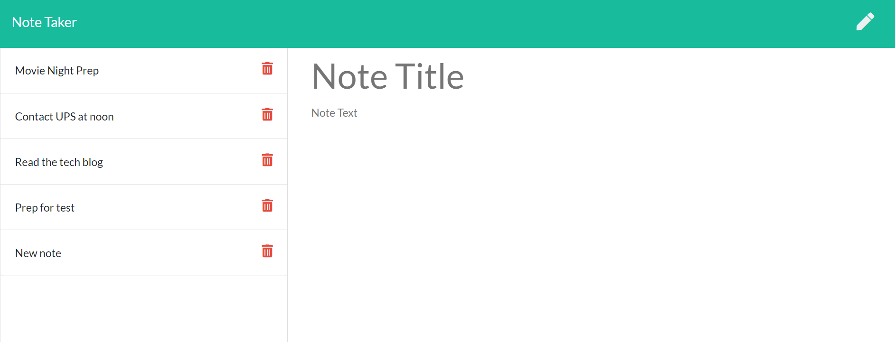
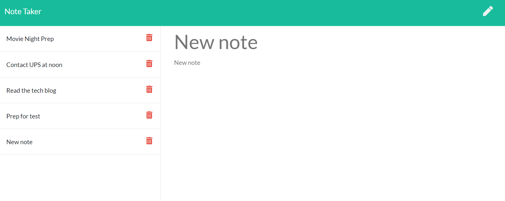
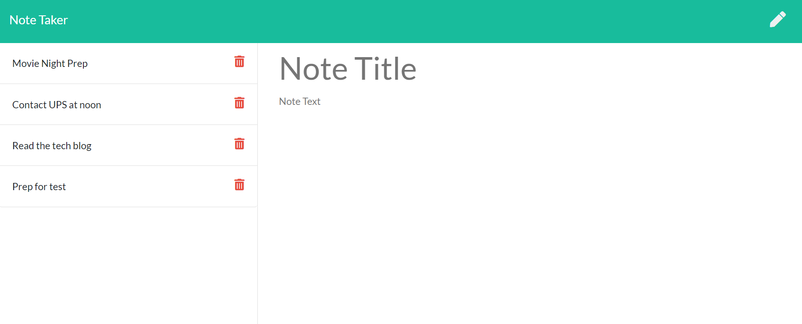

# note-take-master


## Description

Note take master can be used to write and save notes. This applicarion uses an Express.js back end and will save and retrieve note data from a Json file. User can write, retrive and delete note in this appliction.


## Table of Contents

* [Installation](#Installation)

* [Usage](#usage)

* [License](#license)

* [Contributing](#contributing)

* [Tests](#tests)

* [Questions](#questions)


## Installation

To install dependencies, run these commands:

```
npm install
```


## Usage
- When user opens the Note Taker, the landing page with a link to a notes page is presented.


- When user clicks on the link to the notes page, note webpage is presented with existing notes listed in the left-hand column, plus empty fields to enter a new note title and the note’s text in the right-hand column


- WHEN user enters a new note title and the note’s text, a Save icon appears in the navigation at the top of the page. 


- When user clicks on the Save icon,the new note entered is saved and appears in the left-hand column with the other existing notes.


- WHEN user clicks on an existing note in the list in the left-hand column,that note appears in the right-hand column.


- When user clicks on the delete icon next to note, that note is deleted and removed from list.


## License

      Copyright © MIT. All rights reserved. 
      
      Licensed under the MIT license.


## Contributing
To make this project better, please fork the repo and create a pull request. You can also simply open an issue with the tag "enhancement".

* Fork the Project
* Create your Feature Branch (git checkout -b feature/AmazingFeature)
* Commit your Changes (git commit -m 'Add some AmazingFeature')
* Push to the Branch (git push origin feature/AmazingFeature)
* Open a Pull Request


## Tests

To run tests, run these commands:

```
npm test
```

## Questions
This project is contributed by [yul402](https://github.com/yul402/)

Contact infotmation: Ying.li20@outlook.com
